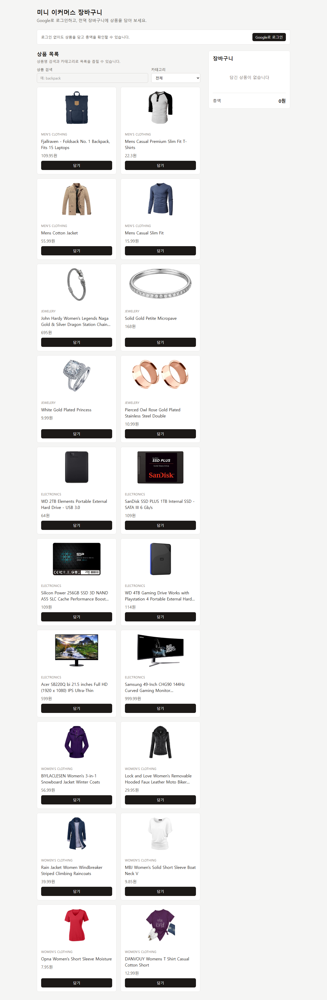
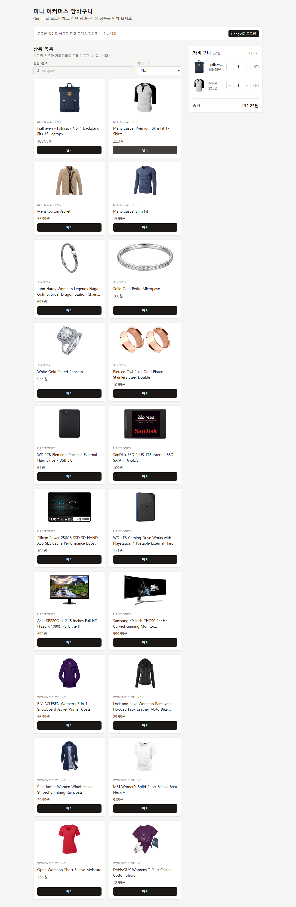
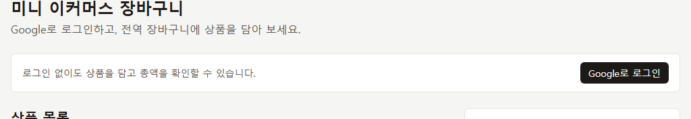
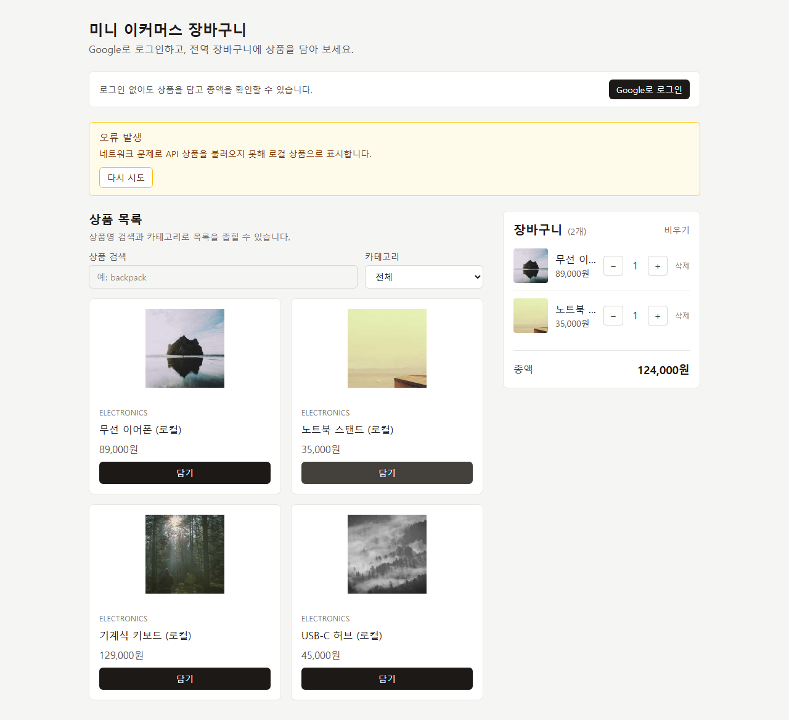

# 미니 이커머스 장바구니 시뮬레이터 (과제 6 · 3단계)

React + TypeScript + Vite로 만든 프론트엔드 장바구니입니다.  
FakeStore API 상품 · Redux Toolkit 전역 장바구니 · Firebase Google 인증을 포함합니다.  
결제·주문·배송·회원 등급은 구현하지 않습니다.  
결과 예시 화면·브랜드·이미지를 복제하지 않았으며, 필수 기능·상태·인증 흐름을 우선했습니다.

관련 문서: `docs/PRD.md` · `docs/SRD.md` · `docs/TRD.md` · `docs/TDD.md` · `docs/LearnNote.md`

---

## 실행 화면

| 장면 | 캡처 |
|------|------|
| 상품 목록 |  |
| 장바구니·총액 |  |
| 인증 영역 (비로그인 / 설정 안내) |  |
| API 오류·mock 폴백 (또는 다시 시도) |  |

캡처는 `docs/captures/`에 있습니다. 실제 이메일·UID 전체가 보이면 마스킹하세요.

---

## 기술 스택

| 영역 | 선택 |
|------|------|
| UI | React, TypeScript, Tailwind CSS |
| 상품 데이터 | FakeStore API (`https://fakestoreapi.com/products`), 실패 시 mock 대체 |
| 전역 상태 | Redux Toolkit + React Redux (`cartSlice`, `authSlice`) |
| 인증 | Firebase Authentication (Google) |
| TypeScript | 사용 (`Product`, `CartItem`, `AuthUser`) |
| 도전·확장 | 상품명 검색, 카테고리 필터, LocalStorage cart 영속화 |

---

## 데이터 · 상태 소유

| 데이터 | 위치 |
|--------|------|
| `product` / loading / error | `App` (`useState` + `fetch`) |
| `cartItem` | Redux `cart` slice (+ LocalStorage 동기화) |
| 총액 | 파생 값 (`price × quantity` 합, state 아님) |
| `authUser` | Redux `auth` slice (`AuthListener` + `onAuthStateChanged`) |

### 타입 요약

- `Product`: `id`, `title`, `price`, `description`, `image`
- `CartItem`: `productId`, `quantity` (정규화 — 이름·가격 미저장)
- `AuthUser`: `uid`, `displayName`, `email`, `photoURL`

### API · 필드 매핑

| FakeStore | 내부 | 비고 |
|-----------|------|------|
| `id` | `id` | number |
| `title` | `title` | 상품명 |
| `price` | `price` | number |
| `image` | `image` | 실패 시 「이미지 없음」 |
| `description` | `description` | 스키마 유지 |

실패 시: 오류 배너 + `mockProducts` 대체 + 「다시 시도」.

### 상품 검색 · 카테고리

- `App`의 `searchTerm` · `selectedCategory` 화면 상태로 목록을 필터링합니다.
- 필터는 상품 목록에만 적용하고, 장바구니 총액 계산은 원본 `products`를 기준으로 유지합니다.
- 결과가 없으면 「검색 결과가 없습니다」를 표시합니다.

### LocalStorage cart

- 키: `mini-ecommerce-cart` (`src/store/cartStorage.ts`)
- store 구독으로 `cart.items`를 저장하고, 초기 state는 저장된 값을 복원합니다.
- 로그아웃 시 `clearCart`로 비우면 LocalStorage도 함께 비워집니다.

### Redux cart

- store: `src/store/index.ts`
- slice: `src/store/slices/cartSlice.ts`
- actions: `addToCart`, `increaseQuantity`, `decreaseQuantity`, `removeFromCart`, `clearCart`
- selectors: `selectCartItems`, `selectTotalQuantity`, `selectTotalPrice` (파생 — state에 total 없음)
- 중복 상품: 같은 `productId`면 수량 +1

### Auth (Firebase)

- 서비스: `src/services/firebase.ts` (초기화 + `loginWithGoogle` / `logout`)
- 상태: `src/store/slices/authSlice.ts` (`user`, `status`, `error`)
- 리스너: `src/components/AuthListener.tsx` — `onAuthStateChanged` 1회 구독
- 환경 변수 `VITE_FIREBASE_*`만 사용 (하드코딩 금지)

### 로그인 정책

- **로그인 전**에도 상품 열람·장바구니 사용을 허용합니다.
- **로그아웃 시** 장바구니를 비웁니다 (`clearCart`). 게스트 최초 로드에서는 비우지 않아 새로고침해도 유지됩니다.
- 사용자별 cart DB 저장은 하지 않습니다.

---

## 설치 · 실행

```bash
npm install
cp .env.example .env
# .env에 Firebase Web 설정 입력 후
npm run dev
```

빌드:

```bash
npm run build
```

배포 (Firebase Hosting):

```bash
npm run deploy
```

배포 URL: https://miniexerciseproject.web.app  

Google 로그인이 배포 도메인에서 실패하면 Console → Authentication → Settings → Authorized domains에  
`miniexerciseproject.web.app` · `miniexerciseproject.firebaseapp.com` 이 있는지 확인하세요.

테스트:

```bash
npm test
```

화면 캡처 / 인증 스모크:

```bash
npm run capture
node scripts/smoke-auth.mjs
```

### 환경 변수

`.env.example`의 `VITE_FIREBASE_*` 자리에 Console의 Web 설정을 넣습니다.  
실제 `.env` 값, service account, Admin private key, 비밀번호는 커밋하지 마세요.

Firebase Console에서 **Authentication → Google** 제공자를 사용 설정하고,  
로컬 개발 시 승인된 도메인에 `localhost`가 있는지 확인하세요.

`auth/configuration-not-found`가 보이면 Authentication을 아직 켜지 않았거나 Google 제공자가 비활성인 상태입니다.  
[Authentication 설정](https://console.firebase.google.com/project/miniexerciseproject/authentication/providers)에서 Google을 Enable한 뒤 새로고침하세요.

`.env`가 없어도 상품 API·Redux 장바구니는 동작합니다. 인증 영역만 설정 안내를 표시합니다.

---

## 테스트 시나리오

1. 새 환경에서 `npm install` → `npm run dev`
2. 상품 로딩 → 목록 표시 (실패 시 「오류 발생」+ mock + 「다시 시도」)
3. 상품 2개 이상 담기 → 장바구니·총액 확인
4. 수량 ± (1에서 − 시 항목 삭제) · 빈 장바구니 안내
5. `.env` 설정 후 Google 로그인 → 사용자 표시 → 로그아웃 시 장바구니 비워짐
6. 로그인 실패 시 오류 안내, cart·상품 목록 유지
7. 비로그인 상태로 새로고침 시 게스트 장바구니 유지
8. 빈 상품 목록 / 이미지 깨짐 시 안내·대체 UI 확인
9. 상품명 검색 → 일치 상품만 표시 / 0건 안내 확인

---

## AI 활용 · 검토 · 수정

| 회차 | 목적 | 프롬프트 요약 | 채택·수정 |
|---:|------|---------------|-----------|
| 1 | PRD/SRD 3단계 | Redux·Firebase를 제품 개요·FR에 반영 | Out of Scope에서 Auth/전역 상태 제외, FR-08·09 추가 |
| 2 | cartSlice | 중복 담기·파생 selector | `slices/cartSlice` + `selectTotalPrice`/`Quantity`, total state 금지 |
| 3 | Firebase Auth | Google + authSlice + clearCart | `AuthListener`에서 uid 전이 시에만 `clearCart` |
| 4 | UI 통합 | App 인증 로딩 게이트 | `AuthListener`를 App으로 이동, 전체 스피너 |
| 5 | 갭 보완 | empty·이미지·재시도·README | `ProductImage`, empty 문구, 「다시 시도」, 제출 섹션 |
| 6 | 도전 기능 | 상품 검색 | App 화면 상태로 검색어 관리, ProductList 필터 결과 표시 |

상세 설계 회고는 `docs/LearnNote.md`를 참고합니다.

---

## 오류 기록

| 번호 | 영역 | 상황 | 원인·수정 |
|---:|------|------|-----------|
| 1 | Redux | cart를 `App` `useState`와 store에 이중으로 두면 불일치 | cart는 `cartSlice`만 사용, App에서 cart state 제거 |
| 2 | Firebase | 첫 로드 `null`마다 `clearCart`하면 게스트 cart 소실 | `prevUidRef`로 직전 uid가 있을 때만 clear |
| 3 | Auth UI | `AuthListener`를 loading/본문 분기에 각각 두면 재구독 | App 최상단에 리스너 1회만 마운트 |
| 4 | API | FakeStore 장애 시 빈 화면 | catch에서 `mockProducts` + 오류 배너 + 「다시 시도」 |

---

## 실시간 · 최종 비교

| 구분 | 실시간(착수) | 최종 |
|------|--------------|------|
| 상태 | Props/`useState` cart 또는 설계만 | Redux `cartSlice` + 파생 selector |
| 인증 | 미착수 또는 설계 | Firebase Google + `authSlice` + AuthListener |
| API | FakeStore + mock 폴백 | 동일 + empty·이미지 대체·재시도·검색 |
| 문서 | PRD/SRD 2단계 | PRD/SRD/TRD/TDD 3.x + LearnNote 3단계 |

---

## 한계 · 다음 개선

- 사용자별 장바구니 DB 저장은 없음 (게스트 cart는 LocalStorage로 유지)
- 상품 상세 페이지 없음
- Firebase 미설정 시 로그인만 비활성 (상품·cart는 동작)
- 다음: 상품 상세·접근성 보강·E2E 테스트

---

## 제출 URL

- GitHub: https://github.com/shinynanasand-sketch/minishoppingmall
- 배포: https://miniexerciseproject.web.app
- `.env`는 커밋하지 않음 (`.gitignore`)

---

## 보안 · 범위

- service account / Admin private key / token / password 없음
- README·캡처에 실제 이메일·UID 전체 노출 자제 (마스킹)
- 결제·주문·배송·회원 등급 없음
- 결과 예시 브랜드·이미지 무단 복제 없음
