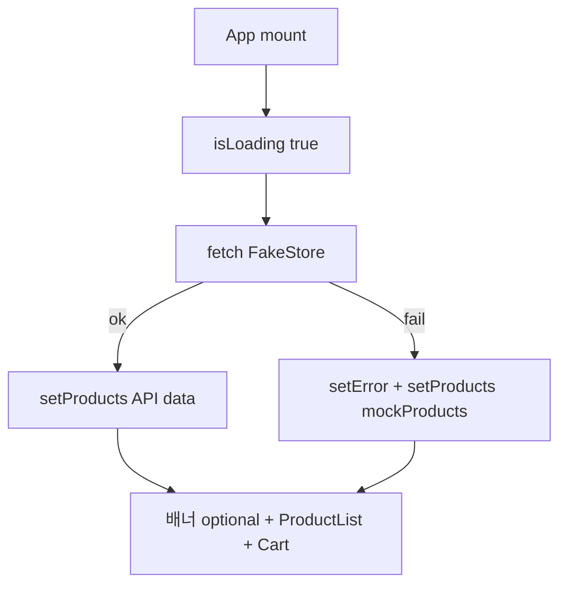
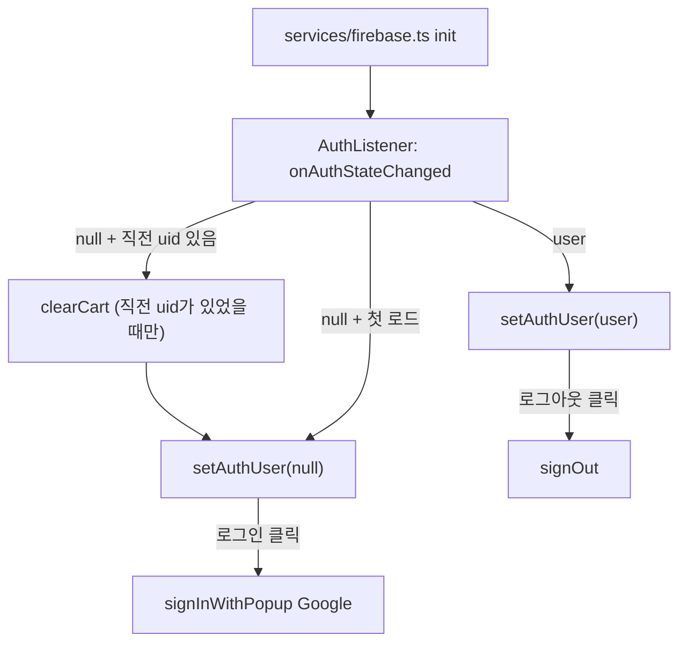

# TRD — 기술 요구사항 / 설계 문서

| 항목 | 내용 |
|------|------|
| 문서명 | Technical Requirements Document |
| 관련 문서 | [PRD.md](./PRD.md), [SRD.md](./SRD.md), [TDD.md](./TDD.md) |
| 단계 | 3단계: Redux Toolkit 전역 장바구니 + Firebase Auth |
| 버전 | 3.4 |

---

## 1. 기술 스택

| 구분 | 선택 |
|------|------|
| 빌드 도구 | Vite |
| UI | React + TypeScript + Tailwind CSS v4 |
| 데이터 | FakeStore API (`fetch`) + 로컬 `mockProducts` 폴백 |
| 전역 상태 | Redux Toolkit + React Redux (`cartSlice` + `authSlice` + 파생 selector) |
| 인증 | Firebase Authentication (Google) |

---

## 2. 디렉터리 구조

```
src/
  types.ts
  data/products.ts         # mockProducts (폴백 전용)
  App.tsx                  # AuthListener + auth 로딩 게이트 + fetch/폴백
  store/
    index.ts               # configureStore, RootState, typed hooks
    slices/
      cartSlice.ts         # cart items + actions + selectors
      authSlice.ts         # auth user + status + error
  services/
    firebase.ts            # Firebase 초기화 + auth + login/logout helpers
  components/
    ProductList.tsx
    Cart.tsx
    AuthBar.tsx            # 로그인 / 로그아웃 / 상태 표시
    AuthListener.tsx       # onAuthStateChanged 1회 구독 → authSlice + clearCart
  main.tsx                 # Provider 래핑
  index.css
.env.example               # Firebase Web 설정 자리표시자
```

---

## 3. 상태 설계

### App (로컬)

```ts
const [products, setProducts] = useState<Product[]>([])
const [searchTerm, setSearchTerm] = useState('')
const [isLoading, setIsLoading] = useState(true)
const [error, setError] = useState<string | null>(null)
```

| 상태 | 역할 |
|------|------|
| `products` | API 또는 mock 중 **현재 활성** 마스터 |
| `searchTerm` | 상품명 검색어 (화면 상태, cart와 분리) |
| `isLoading` | fetch 진행 |
| `error` | 실패 시 `'오류 발생'` (성공 시 `null`) |

### Redux (`cart`)

```ts
type CartState = { items: CartItem[] }
// actions: addToCart, increaseQuantity, decreaseQuantity, removeFromCart, clearCart
// selectors: selectCartItems, selectTotalQuantity, selectTotalPrice(state, products)
```

`totalPrice` / `totalQuantity`는 Redux state에 두지 않고 `createSelector`로 파생한다.

### Redux (`auth`)

```ts
type AuthState = {
  user: AuthUser | null
  status: 'idle' | 'loading' | 'authenticated' | 'unauthenticated'
  error: string | null
}
// actions: setAuthUser, setAuthLoading, setAuthError, clearAuthError
```

| 상태 | 역할 |
|------|------|
| `status = 'loading'` | 초기 `onAuthStateChanged` 대기 (로그인 버튼 오표시 방지) |
| `user` | `AuthUser | null` (Firebase `User` 원본은 저장하지 않음) |
| `error` | 로그인 실패 메시지 |

auth와 cart는 별도 slice로 두고 서로 필드를 복사하지 않는다. 단, **로그아웃/세션 종료 시에는 `clearCart`로 장바구니를 비운다** (§6 참고).

---

## 4. Fetch + 폴백 흐름



1. 성공 → `setProducts(apiData)`, `error = null`
2. 실패 → `setProducts(mockProducts)`, `setError('오류 발생')`
3. `finally` → `setIsLoading(false)`
4. cleanup: `cancelled` 플래그

### 렌더 분기

| 조건 | UI |
|------|-----|
| `auth.status === 'loading'` | App 전체 「인증 상태를 확인하는 중...」 스피너 (AuthBar·상품·장바구니 숨김) |
| `isLoading` (상품) | 「상품을 불러오는 중입니다...」 |
| 그 외 | AuthBar + (`error` 배너 가능) + 검색 가능한 `ProductList` + `Cart` |

---

## 5. 장바구니 알고리즘 (Redux)

1·2단계와 동일 규칙. `productId: number`.

| Action | 규칙 |
|--------|------|
| `addToCart` | 있으면 quantity +1, 없으면 `{ productId, quantity: 1 }` |
| `increaseQuantity` | quantity +1 |
| `decreaseQuantity` | quantity 1이면 제거, 아니면 -1 |
| `removeFromCart` | 해당 `productId` 항목 삭제 |
| `clearCart` | `items`를 빈 배열로 초기화 |

### Selectors

| Selector | 계산 |
|----------|------|
| `selectCartItems` | `state.cart.items` |
| `selectTotalQuantity` | `Σ item.quantity` |
| `selectTotalPrice(state, products)` | `Σ product.price × item.quantity` |

`ProductList` / `Cart`는 `useAppDispatch` / `useAppSelector`로 store에 연결한다.

---

## 6. Firebase Auth 흐름

`AuthListener`는 `App` 하위에서 1회 마운트되어 `onAuthStateChanged`를 구독하고, 콜백에서 `authSlice`를 갱신한다. `App`은 `selectAuthStatus === 'loading'`이면 전체 스피너만 표시한다.



### 로그아웃 시 장바구니 초기화 정책

- `AuthListener`가 **직전 로그인 uid를 ref로 기억**한다.
- 콜백이 `null`이면서 *직전에 uid가 있었을 때만* `dispatch(clearCart())` → 로그아웃·세션 만료 모두 커버.
- 앱 첫 기동의 비로그인(`null`)에서는 clear하지 않아 **게스트 장바구니를 보존**한다.
- `signOut` 성공 시점이 아니라 리스너 전이 기준으로 clear해, 만료·다중 탭 로그아웃도 일관되게 처리한다.

### 환경 변수

- `VITE_FIREBASE_*`만 사용하고 값은 하드코딩하지 않는다 (`.env.example`에 자리표시자만).
- 실제 값·service account·Admin key는 커밋하지 않는다.

---

## 7. 빌드·실행

```bash
npm install
cp .env.example .env   # 실제 Firebase Web 설정 입력
npm run dev
npm run build
```
